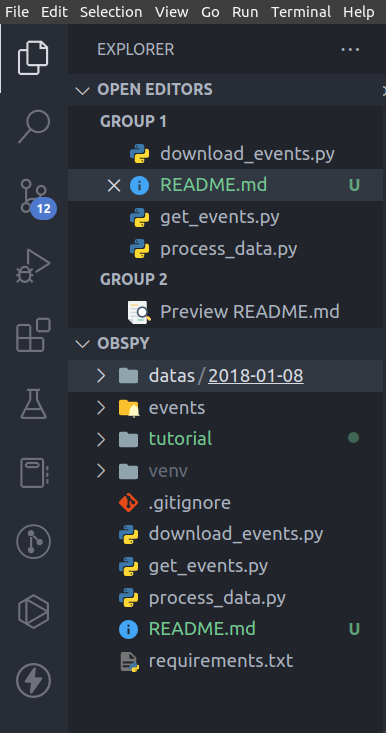
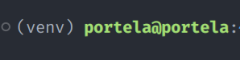
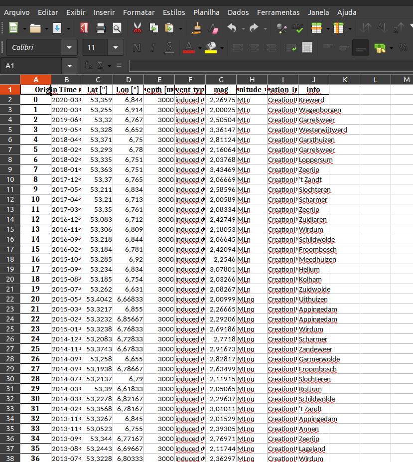
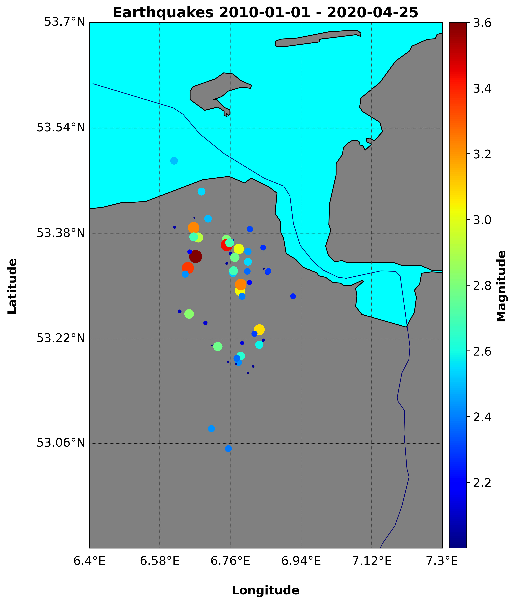
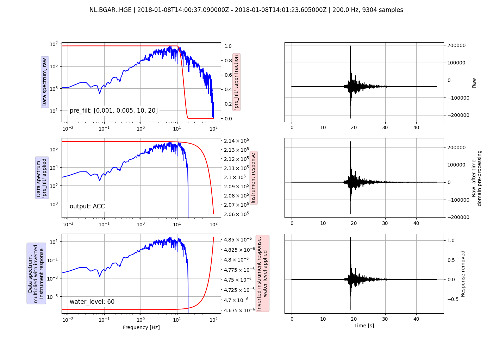
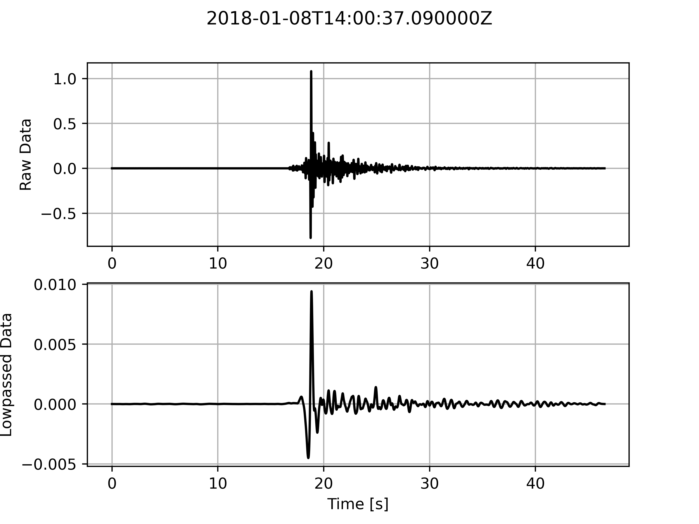

<!-- @import "tutorial/style.html" -->

# Baixar e processar dados de terremotos com ObsPy

## Documentação de uso do programa

    Discente: Danilo Portela de Oliveira
    Docente: Marcelo Peres Rocha
    Matrícula: 222105229
    Disciplina: PROGRAMAÇÃO PARA GEOCIÊNCIAS

O programa foi desenvolvido com o objetivo de utilizar o FDSN da biblioteca obspy para acessar dados Sismológicos. O código pesquisa eventos de terremoto e posteriormente baixa, processa e plota no mapa. A estrutura do projeto é mostrado na Figura 1.



<p class="legend"> Figura 1: Arquitetura do porjeto. </p>

### Exemplo de uso:

#### Passo 1:

O usuário pode optar por criar um ambiente virtual por meio do comando ```python -m venv venv```, logo, ativar o ambiente virtual "venv" com o comando ```source ./venv/bin/activate``` se estiver no Linux, caso esteja no Windows, basta utilizar o comando ```source ./venv/Script/Activate```. Feito isso, o usuário estará fazendo todas as intalações de bibliotecas neste ambiente virtual (Figura 2) utilizando o "requirements.txt". Para isso, basta usar o comando ```pip install -r requirements.txt```. Para desativar o ambiente virtual, basta utilizar o comando ```deactivate```.



<p class="legend"> Figura 2: Ambiente virtual ativado. </p>


#### Passo 2:

Após criar o ambiente virtual e instalar as bibliotecas, o programa está pronto para funcionar. Primeiramente, o usuário executa o arquivo "get_events.py" usando o comando ```python get_events.py```. Esse arquivo irá obter os eventos de terremotos de 2010-01-01 até 2020-04-25 da Holanda. Ele armazenará as informações dos eventos em um arquivo excel e também irá plotar os eventos no mapa. Como saída, será criado uma pasta chamada "events" contendo esses arquivos (ou seja, o arquivo excel "events.xlsx" e o mapa "Earthquakes 2010-01-01 - 2020-04-25.png", mostrados na Figura 3 e 4).



<p class="legend"> Figura 3: Informações dos eventos. </p>



<p class="legend"> Figura 4: Eventos Sismológicos. </p>

#### Passo 3:

Após as informações serem salvas no arquivo excel, o usuário executa o arquivo "download_events.py" usando o comando ```python download_events.py```. Esse arquivo irá ler o arquivo excel 'events.xlsx' e baixe os registros. Como saída, será criado um diretório "datas/2018-01-08" contendo os dados Sismológicos. 

#### Passo 4:

Por último, o usuário executa o arquivo "process_data.py" usando o comando ```python process_data.py```. Esse arquivo irá para cada canal da estação solicitada, remover a resposta instrumental, filtrar os dados e plotar os dados processados. Como saída, dentro do diretório "datas/2018-01-08" é criado uma pasta "plots" com as figuras processadas.



<p class="legend"> Figura 5: Remover a resposta instrumental.



<p class="legend"> Figura 6: Dado filtrado.

